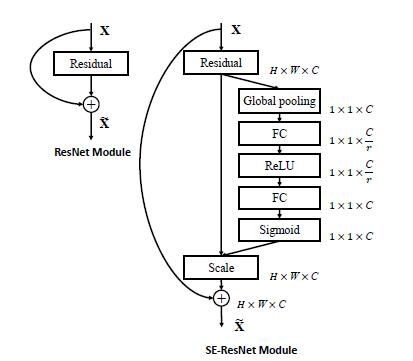

# SE-Resnet-pytorch
This respository support [18, 34, 50, 101, 152] layers SE-Resnet for classfication on customer data.

##Model structure
###The Squeeze-and-Excitation block 

###The SE-Resnet block 

## Customer dataset
This practice support the data format is TextLineDataset, such as in train.txt the data information like this:\
imagename label\
1595164173_0809855_0.jpg 0\
1595164181_4044533_1.jpg 1\
1595164191_0583913_2.jpg 2\
1595164186_8281430_3.jpg 3\
the imagename and label are splited by a space.

## Dependencies
pytorch version      >= 1.0.0\
torchvision version  >= 0.2.1\
opencv               >= 3.4.2.17\
Pillow               >= 6.1.0

## Training model
    python train.py --net=seresnet50 --epochs=100
If you want to use other model, please change the net parameter to seresnet18, seresnet34, seresnet101, seresnet152.

## Inference strategy
The project supports single-image inference while further improving accuracy,
we random crop 3 times from a image, 
the 3 images compose to a batch and compute the softmax scores on them individually. 
The final prediction is the averaged softmax scores of all clips.
the detail please read predicter.py

## Result

## References
- [Squeeze-and-Excitation Networks](https://arxiv.org/pdf/1709.01507.pdf) , [Source Code](https://github.com/hujie-frank/SENet)
- [SENet.pytorch](https://github.com/moskomule/senet.pytorch)
